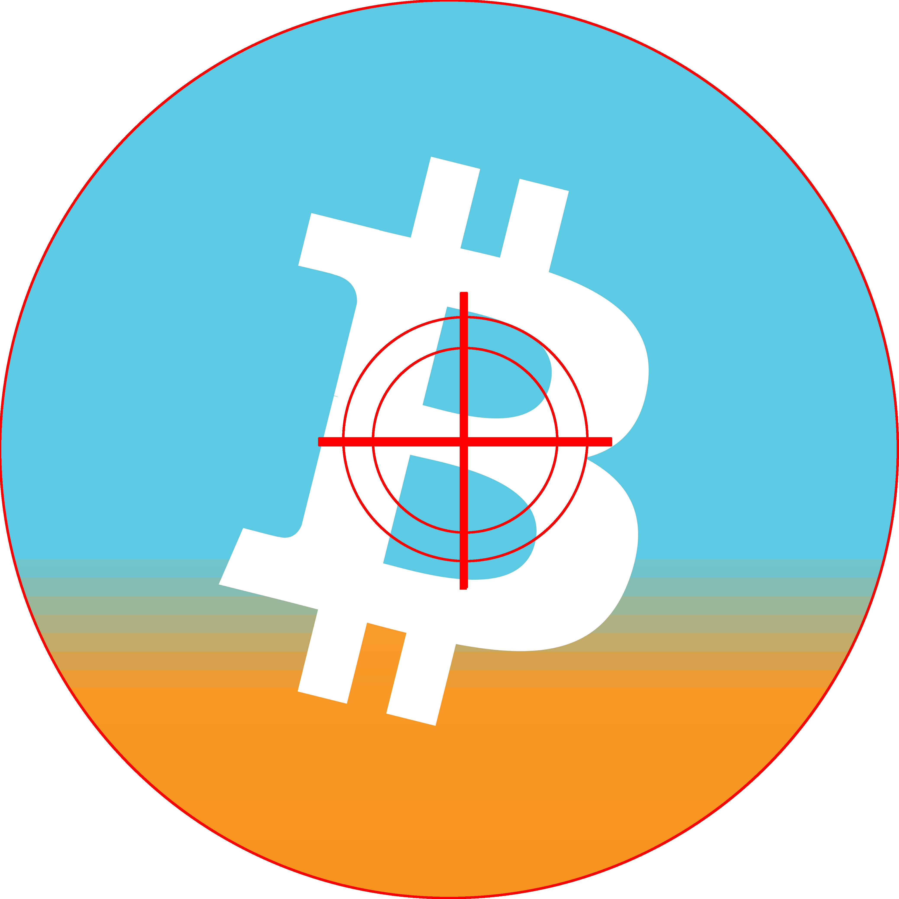

<h1 align="center">
  
    
  Bitgodine
</h1>

<!--  -->

  
  

  <a aria-label="try expo" href="https://app.bitgodine.com"><b>Try the platform</b></a>
 |
  <a aria-label="bitgodine documentation" href="https://docs.bitgodine.com">Read the Documentation</a>

Chain analysis is the attempt to deanonymize pseudo confidential transactions in Bitcoin’s blockchain. This work is usually made by companies working with big institutions, and their techniques are largely unknown. Chain analysis should be open in order to help the technology to establish the best practices and mitigate these techniques.

[**bitgodine**](https://github.com/xn3cr0nx/bitgodine) is a new open source Bitcoin chain analysis platform, inspired from previous Politecnico di Milano's work, [Bitiodine](https://github.com/mikispag/bitiodine).
This work leverages previous work on chain analysis' heuristics to provide a new Bitcoin’s flows tracing approach, based on probabilistic reliability of heuristics on secure basis heuristics.
In this way we provide a convenient platform to trace Bitcoin's flows specifying their probability and entities tagging.

<h2 align="center">
  Project Status
</h2>

This project is under active development. Breaking changes can be introduced and we don't guarantee expected behavior in production.

<h2 align="center">
  Contributing
</h2>

See [CONTRIBUTING.md](https://github.com/xn3cr0nx/bitgodine/blob/main/CONTRIBUTING.md).

Maintainers

- [Patrick Jusic](github.com/xn3cr0nx), Toggl Track, Politecnico di Milano

